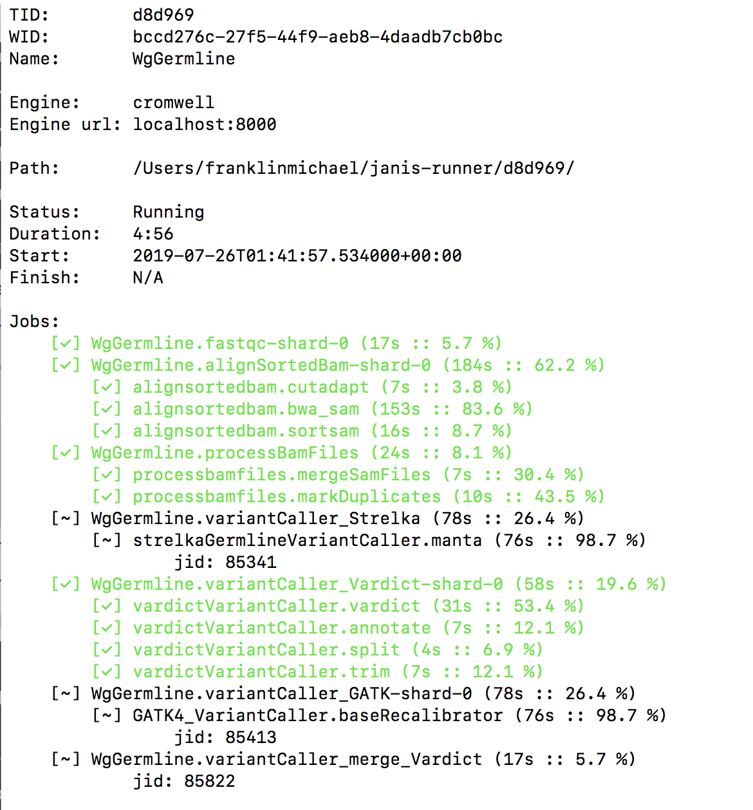

# Welcome to Janis-Assistant

[](https://travis-ci.org/PMCC-BioinformaticsCore/janis-assistant)
[](https://badge.fury.io/py/janis-pipelines.runner)

[Janis](https://github.com/PMCC-BioinformaticsCore/janis) is a workflow assistant designed 
to make the process of building and running workflows easier. 

More specifically:

- Janis core is a framework for specifying workflows, that can be transpiled to CWL and WDL.
- Janis assistant runs manages an engine to these workflows and collects the results. 

## Quick start

```bash
pip3 install janis-pipelines
```

### CWLTool

You can run a workflow in CWLTool with the following command line: 
```bash
janis run --engine cwltool hello
```

To use CWLTool, you must have CWLTool in your path with either Docker or Node, see [Engine support](https://janis.readthedocs.io/en/latest/references/engines.html)
for more information.

### Cromwell

Cromwell is the default engine, and can be ran with:
```bash
janis run --engine cromwell hello
```

To use Cromwell, you must have Java 1.8 available. See [Engine support](https://janis.readthedocs.io/en/latest/references/engines.html#id2)
for more information.

## CLI options:

- `run` - Run a janis workflow (see the run parameters below)
- `watch` - Watch an existing execution (folder or workflow ID)
- `abort` - Issue an abort request to an existing execution
- `inputs` - Generate an inputs file for a workflow
- `translate` - Translate a workflow into CWL / WDL
- `metadata` - Get the available metadata on an execution
- `version` - Print the version of `janis` submodules.
- `spider` - Print documentation for a tool (allows to trace problems with the Janistoolbox)

### `run`

You can run a workflow with the `run` method, here's an example to run the hello world example:

```bash
janis run hello
```

View the help guide 

```
# $ janis run -h

positional arguments:
  workflow              Run the workflow defined in this file or available
                        within the toolbox
  extra_inputs

optional arguments:
  -h, --help            show this help message and exit
  -i INPUTS, --inputs INPUTS
                        YAML or JSON inputs file to provide values for the
                        workflow (can specify multiple times)
  -o OUTPUT_DIR, --output-dir OUTPUT_DIR
                        This directory to copy outputs to. By default
                        intermediate results are within a janis/execution
                        subfolder (unless overriden by a template)
  -B, --background      Run the workflow engine in the background (or submit
                        to a cluster if your template supports it)
  --progress            Show the progress screen if running in the background
  --keep-intermediate-files
                        Do not remove execution directory on successful
                        complete
  --skip-file-check     Skip checking if files exist before the start of a
                        workflow.
  --allow-empty-container
                        Some tools you use may not include a container, this
                        would usually (and intentionally) cause an error.
                        Including this flag will disable this check, and empty
                        containers can be used.
  --development         Apply common settings (--keep-execution-dir + --mysql)
                        to support incremental development of a pipeline

input manipulation:
  -r RECIPE, --recipe RECIPE
                        Use a provided recipe from a provided template
  --max-cores MAX_CORES
                        maximum number of cores to use when generating
                        resource overrides
  --max-memory MAX_MEMORY
                        maximum GB of memory to use when generating resource
                        overrides

hints:
  --hint-captureType {targeted,exome,chromosome,30x,90x,300x}
  --hint-engine {cromwell}

workflow collection arguments:
  --toolbox            Skip looking through the search path, and only look in
                        the toolbox
  -n NAME, --name NAME  If you have multiple workflows in your file, you may
                        want to help Janis out to select the right workflow to
                        run
  --no-cache            Force re-download of workflow if remote

engine arguments:
  --engine {cwltool,cromwell}
                        Choose an engine to start
  --cromwell-url CROMWELL_URL
                        Location to Cromwell

filescheme arguments:
  -f {local,ssh}, --filescheme {local,ssh}
                        Choose the filescheme required to retrieve the output
                        files where your engine is located. By selecting SSH,
                        Janis will SCP the files using the --filescheme-ssh-
                        binding SSH shortcut.
  --filescheme-ssh-binding FILESCHEME_SSH_BINDING
                        Only valid if you've selected the ssh filescheme. (eg:
                        scp cluster:/path/to/output local/output/dir)

validation arguments:
  --validation-reference VALIDATION_REFERENCE
                        reference file for validation
  --validation-truth-vcf VALIDATION_TRUTH_VCF
                        truthVCF for validation
  --validation-intervals VALIDATION_INTERVALS
                        intervals to validate between
  --validation-fields VALIDATION_FIELDS [VALIDATION_FIELDS ...]
                        outputs from the workflow to validate

beta features:
  --mysql               BETA: Run MySQL for persistence with Cromwell
```

## Configuration

It's possible to configure a number of attributes of `janis_assistant`. 
You can provide a YAML configuration file in two ways:

- CLI: `--config /path/to/config.yml`
- Environment variable `JANIS_CONFIGPATH=/path/to/config.yml`
- Default: `$(HOME)/.janis/janis.conf` - will additionally look for a config here.

> Configurations aren't currently cascaded, but the intention is they will.

### Options

Defaults: [`janis_assistant/management/configuration.py`](https://github.com/PMCC-BioinformaticsCore/janis-assistant/blob/master/janis_assistant/management/configuration.py#L68)

- Config / DB directory: `configDir: /path/to/configir/`
    - Second priority to environment variable: `JANIS_CONFIGDIR`
    - Default: `(HOME)/.janis/`
    - Database: `{configDir}/janis.db` - Janis global database
    
- Execution directory: `executionDir`
    - Second priority to environment variable: `JANIS_EXCECUTIONDIR`
    - Default: `(HOME)/janis/execution/`
    
- Search paths: `searchPaths`
    - Will additionally add from environment variable: `JANIS_SEARCHPATH`
    - Default: `(HOME)/janis/`


## Engines

There are currently 2 engines that `janis_assistant` supports:

1. CWLTool
2. Cromwell

### CWLTool (default)
    
Due to the way CWLTool provides metadata, support for CWLTool is very basic, and limited to submitting 
workflows and linking the outputs. Janis can manage CWLTool in the background, except if CWLTool is 
terminated (through some transient cluster error), Janis is unable to restart it.


### Cromwell

Cromwell can be run in two modes:

1. Connect to an existing instance (well supported) - include the `--cromwell-url` argument with the port to 
    allow the Janis assistant to correctly connect to this instance.
    
2. Run and manage it's own instance. When the task is started, the `process_id` of the started Cromwell instance
    is stored in the `taskdb`, when the task finishes execution, Janis stops this Cromwell instance. Janis
    can manage a MySQL (in fact MariaDB) instance with the `--mysql` flag for durability and to reduce memory overhead.
    
Both of these options provide reporting and progress tracking due to Cromwell's extensive metadata endpoint. The TaskID
(6 hex characters) is included as a label on the workflow.

```bash
janis watch $tid
``` 

A screenshot of the running the example [whole genome germline pipeline](https://github.com/PMCC-BioinformaticsCore/janis-examplepipelines)
 (for a targeted sample) can be found below. (All engines can support this through a generalised metadata semantic (`TaskMetadata`),
 Neither CWLTool or Toil support much polling of metadata).

> 

Extra Cromwell comments:

- The TaskID is bound as a label on GCP instances (as `wid`, allowing you to query this information).
- Janis uses the development spec of WDL, requiring Cromwell-42 or higher.
- If asking Janis to start its own Cromwell instance, it requires the jar to be exported as `$cromwelljar`.


### Databases

> This feature requires better documentation in the primary Janis documentation.

Some features of Cromwell require a database to use: call-caching, resumability for cluster failures and so on.

Previously, this has been managed through automatically spinning up a mysql instance with Docker / Singularity, however this has been unstable. Now, as Cromwell supports a [file-based database](https://cromwell.readthedocs.io/en/stable/Configuring/#database), this is now the default.

- No options -> file-based DB
- `--no-database` -> No database is ran
- `--mysql` -> Automatically provision and manage a mysql server (unchanged)
- Configure an existing 

Call caching has been enabled by default using the `file` based method, we strongly recommend downloading Cromwell >50 and using `fingerprint`, see [call caching documentation](https://janis.readthedocs.io/en/latest/references/callcaching.html) for more information.

WARNING: `fingerprint` will become the default once Cromwell 50 has been released. This might break if you're using older versions of Cromwell.


### Filesystem

There is a weak concept of a filesystem for where your workflow is executed. This tool is really only developed
for using the `LocalFileSystem`.

Supported filesystems:

- LocalFileScheme
- SSHFileScheme (`identifier`, `connectionstring`) - I'd recommend creating an 
    [SSH shortcut](https://scotch.io/tutorials/how-to-create-an-ssh-shortcut) to avoid persisting personal details in
    database. Janis uses the connection string like so: `scp connectionstring:/path/to/output /local/persist/path`


## Databases

Janis stores a global SQLite database at `{configDir}/janis.db` of environments and task pointers 
(default: `~/.janis/janis.db`). When a task is started, a database and workflow files are copied 
to your specified output directory.
 
